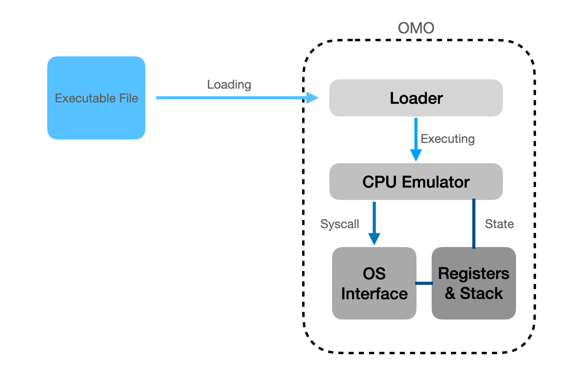

Components
===

flexEmu comprises four key components in present:

* Loader: Loading process for executing in flexEmu emulator.
* CPU Emulator: Emulate instructions on host machine. 
* Registers and Stack: Emulate registers and stack in memory for snapshot.
* OS Interface: Emulate system calls on host OS.

## Loader

The code loader currently supports the ELF loader, which completely emulates the process of loading elf code under linux: [How programs get run: ELF binaries](https://lwn.net/Articles/631631/).

Its main implementation.

- Parsing out code and data segments and loading them into memory.
- Initialize the code entry and environment variables.
- Initialize the stack pointer and the program counter (i.e., the code entry).

After complete loading, the entire program is in a runnable state.

## CPU Emulator

Based on [Unicorn](https://github.com/unicorn-engine/unicorn) to achieve multi CPU ISA supports and memory management.

## Registers and Stack

On top of CPU Emulator, flexEmu provides an abstraction of the stack, as well as more advanced register and memory operations. This allows us to easily take snapshots of the running state.

## OS Interface

flexEmu simulates a large number of system calls and guarantees that the calls are idempotent.